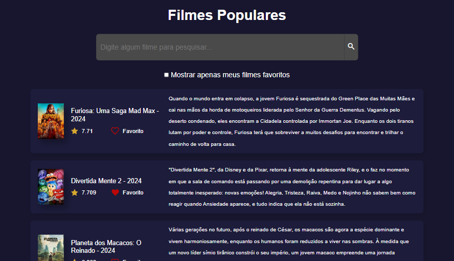

# Popular Movies

## 📖 Descrição

Este projeto foi desenvolvido como parte do desafio #7DaysOfCode, com o objetivo de criar uma aplicação web simples para exibir os filmes mais populares utilizando uma API pública. O foco principal foi praticar o uso de JavaScript puro para manipulação do DOM e criação de uma interface dinâmica e interativa.

## 🎯 Funcionalidades

° Consumo de uma API de filmes para obter os dados dos filmes mais populares.

° Exibição dos filmes em uma interface amigável e responsiva.

° Capacidade de favoritar filmes para acesso rápido.

° Pesquisa básica de filmes por título.

## 🛠️ Tecnologias 

## ⌛ Status do Projeto

Concluído
